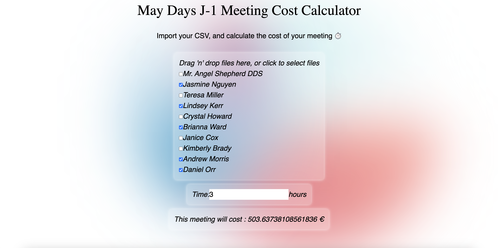

# Meeting cost calculator

A meeting cost calculator developed with Next.js to calculate the total cost of a meeting based on selected employees and meeting duration.

## Features

Upload a CSV file containing employee data (name and hourly wage).
Select employees to include in the meeting.
Input the meeting duration in hours.
Automatically calculate the total meeting cost based on selected employees and entered duration.
Screenshot

## Technologies Used
Next.js
React
CSV Parser
Tailwind CSS (for styling)

## Author
Jean LECIGNE
