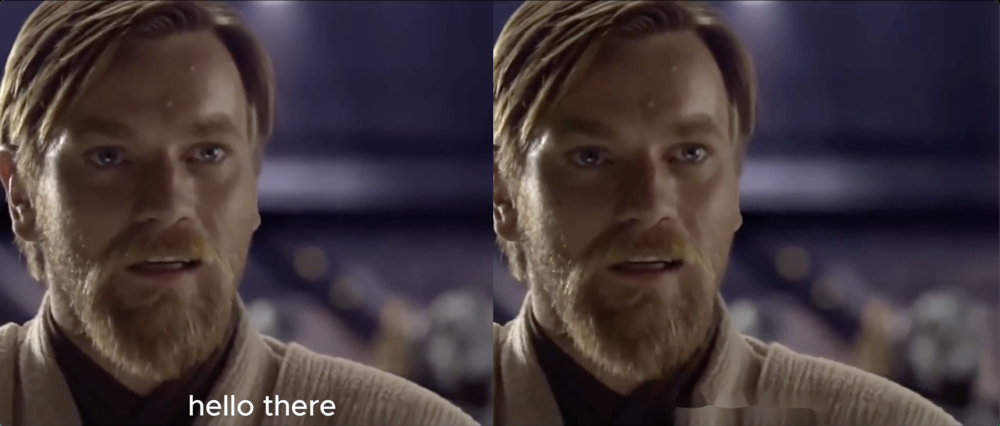

# Video Subtitle Removal Tool

This Jupyter Notebook demonstrates how to remove subtitles or text overlays from images using Python and OpenCV (cv2) for image processing techniques like thresholding, morphological operations, and inpainting.

## How It Works

The notebook follows these steps to remove subtitles from an image:
1. Load and Display Image: Loads the input image using OpenCV and displays it within the notebook.
2. Convert to Grayscale: Converts the image to grayscale for simpler processing.
3. Thresholding: Applies binary thresholding to create a binary mask of the areas with text.
4. Morphological Operations:
    * Closing: Uses morphological closing to fill small holes in the foreground text.
    * Dilation: Expands the text regions to connect disjointed parts.
5. Find Contours: Identifies contours in the processed image to locate the text regions.
6. Mask Creation: Creates a mask based on the detected text regions.
7. Inpainting: Uses the mask to inpaint (fill in) the text regions with surrounding image content to remove the subtitles.
8. Display Results: Displays the original image, processed stages (thresholded image, mask, cleaned image), and saves the cleaned image as cleaned_image.jpg.

## Technologies Used
Python Jupyter OpenCV

## Repository

[Discover the code, GitHub repo here =>](https://github.com/Phenixjj/Maydays/tree/master/md-p-04_automatic_subtitle_removal)

## Author
Jean LECIGNE
