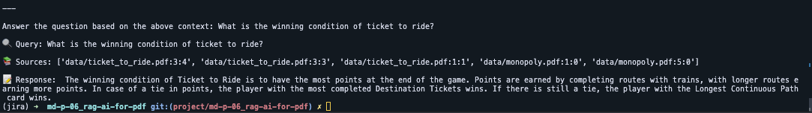

# R.A.G AI for .pdf

Retrieval-Augmented Generation (RAG) AI for PDF is a project that uses the RAG model from Hugging Face to process and understand PDF documents.

## How It Works

1. **PDF Processing:** The text is extracted from the PDF documents and preprocessed for the RAG model.
2. **RAG Model:** The RAG model is used to understand the content of the PDF and generate responses based on it.
3. **Output:** The output is provided in a structured format or as a natural language summary, depending on your needs.

## Technologies Used
Python Ollama Langchain ChromaDB

## Repository

[Discover the code, GitHub repo here =>](https://github.com/Phenixjj/Maydays/tree/master/md-p-06_rag-ai-for-pdf)

## Author
Jean LECIGNE