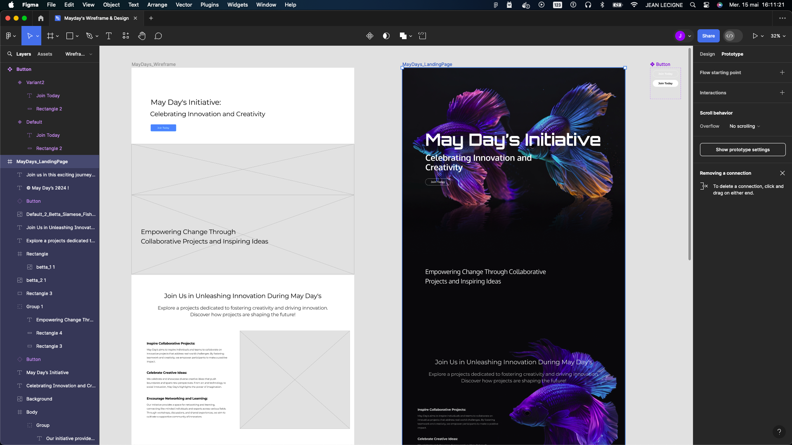

# MayDays Website Wireframe & Design

Welcome to the MayDays website wireframe and design repository! This project showcases the initial wireframe layout and the final design concept for the MayDays initiative website.

## Overview

The purpose of this repository is to provide insights into the development process of the MayDays website, from conceptualization to the final design. It includes both the wireframe, outlining the basic structure and layout, and the design, showcasing the visual aesthetics and user interface elements.

## Technologies Used

1. **Figma:** Used for creating the wireframe and design mockups, allowing collaborative editing and real-time feedback.
2. **Leonardo.ai:** Utilized for generating visual assets and enhancing design elements with AI-powered tools.
3. **Photoshop/Gimp:** Employed for detailed image editing and refining visual components of the website design.

[Go to figma](https://www.figma.com/design/QStPzuEQjtnIFRhFv1HzQX/Mayday's-Wireframe-%26-Design?node-id=107%3A599&t=9k3fx0NfuHM5WxOS-1)

## Author
Jean LECIGNE