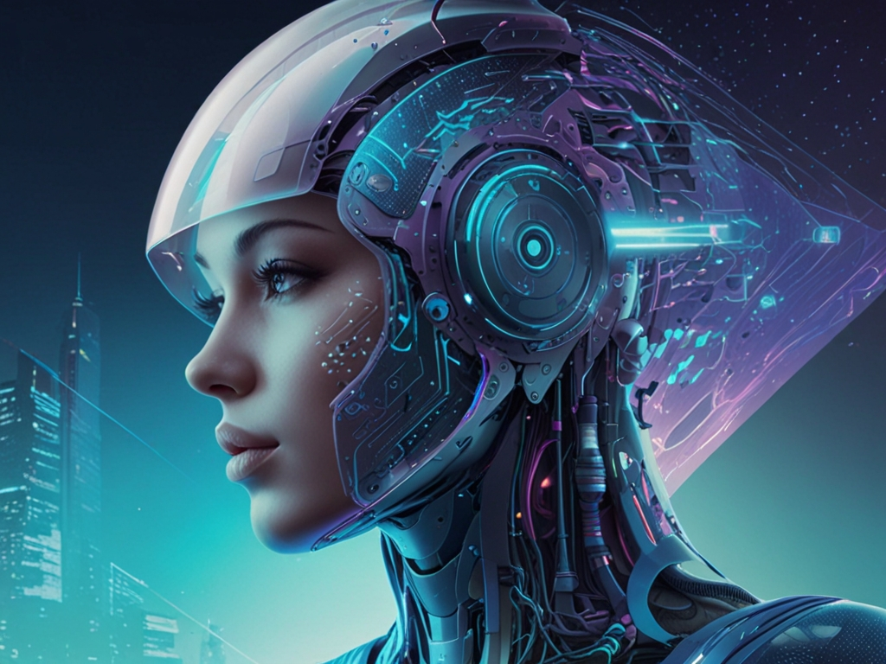

# AI Advanced Agent using RAG

## Introduction

This project is an implementation of an AI Advanced Agent using the Retrieval-Augmented Generation (RAG) model. The goal of this project is to create an AI agent that can understand and respond to complex queries, leveraging the power of both retrieval-based and generative transformers.

## Features

- **Retrieval-Augmented Generation**: The agent uses the RAG model which combines the benefits of retrieval-based and generative models for machine learning.
- **Advanced Understanding**: The agent is designed to understand complex queries and provide accurate responses.
- **Scalability**: The design of the agent allows it to be easily scaled up to handle larger datasets and more complex tasks.

## Technologies Used

Python LlamaIndex Ollama OpenAI

[Discover the code, GitHub repo here =>](https://github.com/Phenixjj/Maydays/tree/master/md-p-11_Crew-AI-and-RAG)

## Author
Jean LECIGNE