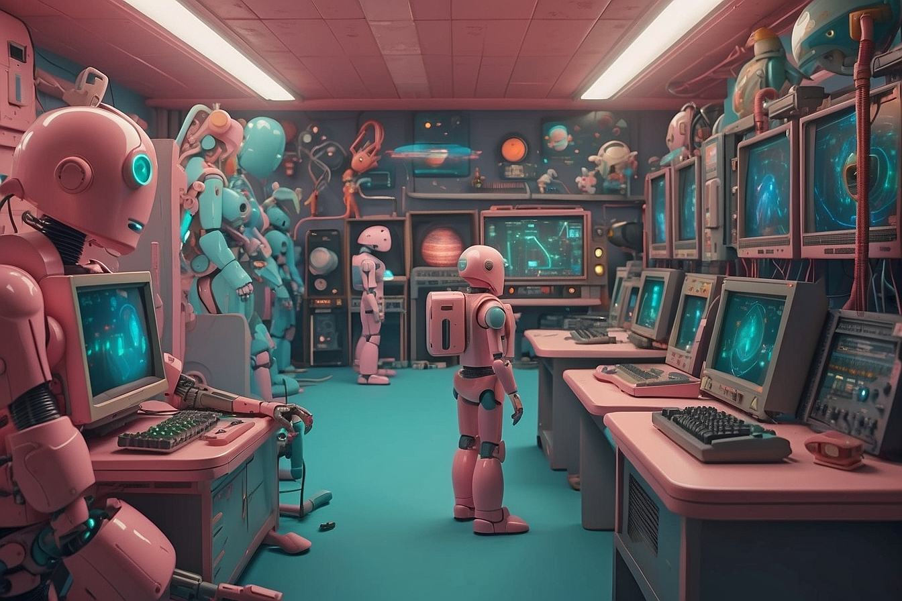

# Old Games Reborn

A Python project that translates classic computer games from the 1980s into Python using the BASIC language, powered by a custom translation tool.



## Features

This repository includes a collection of classic computer games originally written in BASIC, as featured in the old book. Each game has been meticulously translated into Python code, allowing enthusiasts to experience and play these nostalgic titles on modern systems.

## Read the book
[Computer Space Games](https://colorcomputerarchive.com/repo/Documents/Books/Computer%20Spacegames%20(1982)(Usborne%20Publishing).pdf)

## Prerequisites

Python 3

## Installation
Clone the GitHub repository:

```bash
git clone https://github.com/Phenixjj/Maydays.git
```

Navigate to the project directory:

```bash
cd md-p-02_old-game-reborn
```

Install dependencies:

```bash
pip install cowsay
```

Usage

```bash
python main.py
```

Follow the steps in the terminal and enjoy old school computers games

## Technologies Used
Python

## Contributing
Contributions to the project are welcome! To contribute:

Fork the repository

Create a new branch (git checkout -b feature/my-feature)
Commit your changes (git commit -am 'Add a new feature')
Push the branch (git push origin feature/my-feature)
Open a Pull Request

## Author
Jean LECIGNE

License
This project is licensed under the MIT License - see the LICENSE file for details.

Feel free to adapt this template based on the specifics of your project, such as the repository name, technologies used, implemented features, etc. Ensure to provide clear instructions on installation, usage, and contribution to make your README informative and accessible to anyone interested in exploring or contributing to the project.
