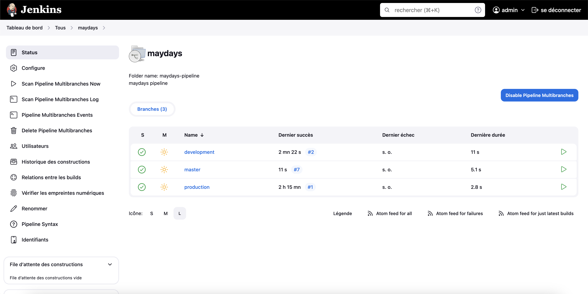

# Jenkins Mayday's Pipeline

This project showcases a Jenkins multibranch pipeline configured specifically for Mayday's repo, demonstrating CI/CD practices and automation.


## Prerequisites
Ensure the following tools are installed and configured:

* Jenkins
* Git
* Docker (optional, if using containers)
* Your Mayday's project repository


## Features



The Jenkins pipeline automates the build, test, and deployment processes for Mayday's projects. It includes stages for:

* Building the application from source code
* Running automated tests
* Deploying to development, staging, or production environments based on branch or tag
* Generating release notes or notifications

## Setup
1. Install and configure Jenkins on your server or local machine.
2. Set up required plugins for Jenkins (e.g., Pipeline, Git plugin).
3. Configure Jenkins credentials for accessing your version control system.
4. Create a new pipeline job in Jenkins and configure it to use your project's repository.

## Jenkinsfile
The Jenkins pipeline is defined in a Jenkinsfile located at the root of the project repository. This file contains stages, steps, and configurations for building, testing, and deploying your application.

Example :
```groovy
pipeline {
    agent any
    
    stages {
        stage('Build') {
            steps {
                sh 'mvn clean package'
            }
        }
        stage('Test') {
            steps {
                sh 'mvn test'
            }
        }
        stage('Deploy') {
            steps {
                sh 'kubectl apply -f deployment.yaml'
            }
        }
    }
}
```

## Usage
1. Trigger the pipeline manually or configure webhook triggers for automatic builds.
2. Monitor build and deployment status via Jenkins dashboard.
3. Review logs and artifacts generated during the pipeline execution.

## Contributing
Contributions to the project are welcome! To contribute:

Fork the repository

Create a new branch (git checkout -b feature/my-feature)
Commit your changes (git commit -am 'Add a new feature')
Push the branch (git push origin feature/my-feature)
Open a Pull Request

## Author
Jean LECIGNE

License
This project is licensed under the MIT License - see the LICENSE file for details.

Feel free to adapt this template based on the specifics of your project, such as the repository name, technologies used, implemented features, etc. Ensure to provide clear instructions on installation, usage, and contribution to make your README informative and accessible to anyone interested in exploring or contributing to the project.
