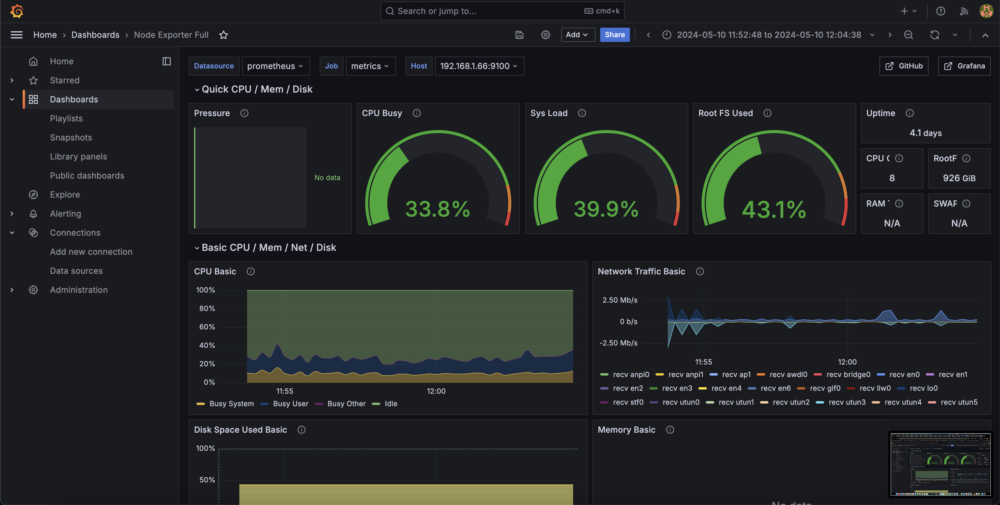

# Effortless System Monitoring

This repository contains a Docker Compose setup for effortless system monitoring using Prometheus, Grafana, and Node Exporter.



## Prerequisites
Ensure the following tools are installed and configured:

* Docker
* Docker Compose
* Node Exporter

## How It Works

The setup follows these steps to monitor your system:
1. **Prometheus:** Collects metrics from monitored targets by scraping metrics HTTP endpoints on these targets.
2. **Node Exporter:** Exposes a wide variety of hardware and kernel related metrics from systems.
3. **Grafana:** Provides a powerful and elegant way to create, explore, and share dashboards and data with your team and the world.

## Setup

### Install Node Exporter

#### MacOS :

##### Install node_exporter using brew
```bash
brew install node_exporter
```
##### Launch node_exporter service
```bash
brew services start node_exporter
```


#### Linux :

##### Download and install node_exporter:
```bash
wget https://github.com/prometheus/node_exporter/releases/download/v1.8.0/node_exporter-1.8.0.linux-arm64.tar.gz
tar xvf node_exporter-1.8.0.linux-arm64.tar.gz
cd node_exporter-1.8.0.linux-arm64 sudo cp node_exporter /usr/local/bin
rm -rf ./node_exporter-1.8.0.linux-arm64
```

##### Create a dedicated user for running Node Exporter:
```bash
sudo useradd --no-create-home --shell /bin/false node_exporter
```

##### Assign ownership permissions of the node_exporter binary to this user:
```bash
sudo chown node_exporter:node_exporter /usr/local/bin/node_exporter
```

##### Configure the Service
```bash
sudo nano /etc/systemd/system/node_exporter.service
```
Then, paste the following configuration:
```bash
[Unit]
Description=Node Exporter
Wants=network-online.target
After=network-online.target

[Service]
User=node_exporter
Group=node_exporter
Type=simple
ExecStart=/usr/local/bin/node_exporter
Restart=always
RestartSec=3

[Install]
WantedBy=multi-user.target
```
Save and exit the editor.

##### Enable and Start the Service
```bash
sudo systemctl daemon-reload
sudo systemctl enable node_exporter
sudo systemctl start node_exporter
sudo systemctl status node_exporter.service
```

### Check Node Exporter Running
```bash
curl http://localhost:9100/metrics
```

1. Clone the repository.
2. Setup prometheus job_name metrics ip adress
2. Navigate to the project directory.
3. Run `docker-compose up -d`.

## Accessing the Tools

* Prometheus: `http://localhost:9090`
* Grafana: `http://localhost:3000`

## Notes
This setup is designed for simple system monitoring tasks and may require adjustments for complex or specific use cases.

## Contributing
Contributions to the project are welcome! To contribute:

* Fork the repository
* Create a new branch (`git checkout -b feature/my-feature`)
* Commit your changes (`git commit -am 'Add a new feature'`)
* Push the branch (`git push origin feature/my-feature`)
* Open a Pull Request

## Author
Jean LECIGNE

## License
This project is licensed under the MIT License - see the LICENSE file for details.

Feel free to adapt this template based on the specifics of your project, such as the repository name, technologies used, implemented features, etc. Ensure to provide clear instructions on installation, usage, and contribution to make your README informative and accessible to anyone interested in exploring or contributing to the project.