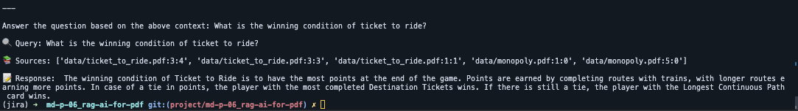

# R.A.G AI for .pdf

Retrieval-Augmented Generation (RAG) AI for PDF is a project that uses the RAG model from Hugging Face to process and understand PDF documents.



## Prerequisites

Before you begin, ensure you have met the following requirements:

* You have installed Python 3.8 or higher.
* You have installed requirements.txt using pip
* You have installed Ollama with your favorite llms models

## How It Works

1. **PDF Processing:** The text is extracted from the PDF documents and preprocessed for the RAG model.
2. **RAG Model:** The RAG model is used to understand the content of the PDF and generate responses based on it.
3. **Output:** The output is provided in a structured format or as a natural language summary, depending on your needs.

## Usage

### Store pdf
Store your pdf in the data folder

### Populate the database
```bash
python populate_database.py
```

### Query your data
```bash
python query_data.py --query_text "your fabulous question about your data ?"
```

## Notes
This setup is designed for simple system monitoring tasks and may require adjustments for complex or specific use cases.

## Contributing
Contributions to the project are welcome! To contribute:

* Fork the repository
* Create a new branch (`git checkout -b feature/my-feature`)
* Commit your changes (`git commit -am 'Add a new feature'`)
* Push the branch (`git push origin feature/my-feature`)
* Open a Pull Request

## Author
Jean LECIGNE

## License
This project is licensed under the MIT License - see the LICENSE file for details.

Feel free to adapt this template based on the specifics of your project, such as the repository name, technologies used, implemented features, etc. Ensure to provide clear instructions on installation, usage, and contribution to make your README informative and accessible to anyone interested in exploring or contributing to the project.