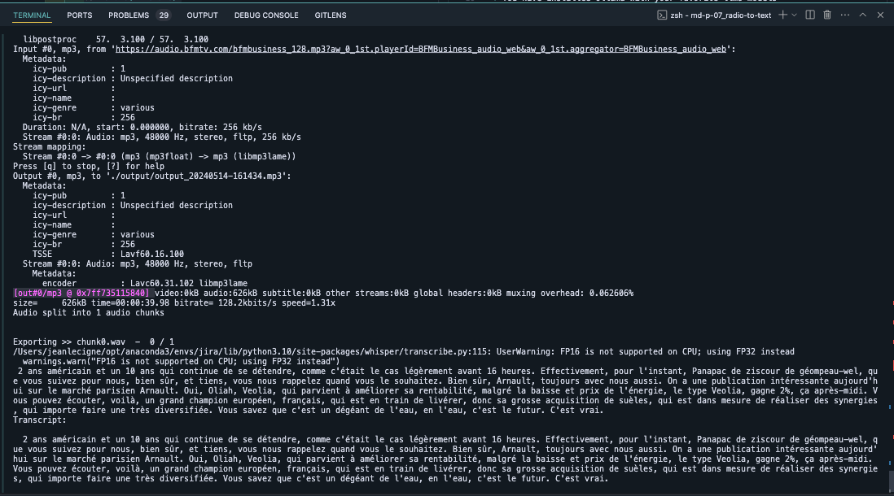

# Radio to text

This project is designed to convert radio broadcasts into text format. It uses speech recognition and audio processing libraries to transcribe audio files.




## Prerequisites

Before you begin, ensure you have met the following requirements:

* You have installed Python 3.10 or higher
* You have ffmpef installed
* You have installed requirements.txt using pip

## How It Works

1. **Audio Processing:** The audio files are extracted from the radio broadcasts and converted into a suitable format for transcription.
2. **Speech Recognition:** The OpenAPI-Whisper is used to transcribe the audio content into text.
3. **Output:** The transcribed text is saved in the output directory and can be used for further processing or analysis.

## Usage

```bash
python main.py
```

## Notes
This setup is designed for simple audio transcription tasks and may require adjustments for complex or specific use cases. For instance, audio files with significant background noise or multiple speakers may not be transcribed as accurately. Additionally, the transcription accuracy can be influenced by the quality of the audio file and the clarity of the speech.

## Contributing
Contributions to the project are welcome! To contribute:

* Fork the repository
* Create a new branch (`git checkout -b feature/my-feature`)
* Commit your changes (`git commit -am 'Add a new feature'`)
* Push the branch (`git push origin feature/my-feature`)
* Open a Pull Request

## Author
Jean LECIGNE

## License
This project is licensed under the MIT License - see the LICENSE file for details.

Feel free to adapt this template based on the specifics of your project, such as the repository name, technologies used, implemented features, etc. Ensure to provide clear instructions on installation, usage, and contribution to make your README informative and accessible to anyone interested in exploring or contributing to the project.